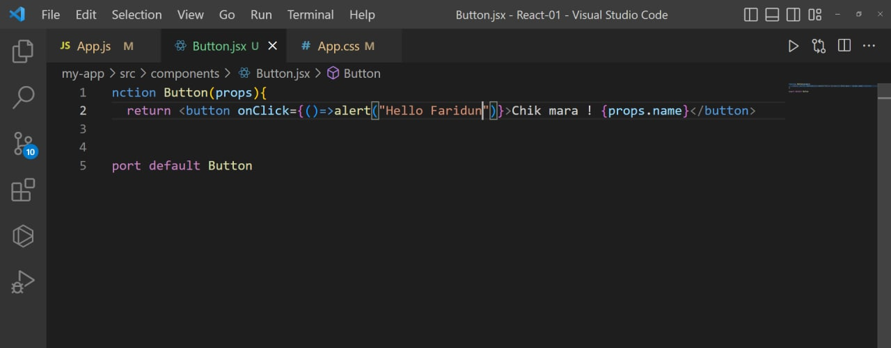

# Components
## Components 
## are independent 
## and reusable 
## bits of code.

// Translete 
Составные части
независимы
и многоразовые
биты кода.

# 1 -first we make a folder

# 2-second we make a our function like this 

# 3-We show our function at main Project

# 4-We see the result of our function

# 5-If we write events we do like this

# 6-If we want to compare or put some rules we do like this
